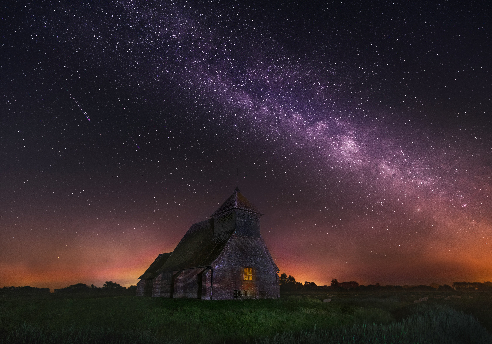

# Quick References
## [Author](#author)| [📗Description](#description)| [📃My favourite university subjects](#my-favourite-university-subjects)| [🧑‍🎓Online VS Offline studying](#here-is-what-i-think-about-each-of-the-studying-options)| [My favourite math formulae](#my-favourite-math-formulae) | [My coding skills](#i-am-a-skilled-enough-to-do-some-coding---here-is-one-of-the-examples)| [The image I like](#the-image-i-like)|


## 👨‍🦰💻Author
### 
- **Name:** *Myroslav Pohasii*
- **Group:** *KH-125*
- **Date:** *23.12.2025*

## 📗Description

###
Hello! My name is Myroslav,and this is my first GitHub repo. Here I practice my skills at writing markdown texts, LaTeX formulae and other fun things.

## 📃My favourite university subjects

### Currently my favourite subjects are:

1. Math
2. Coding
3. English

## 🧑‍🎓Online VS Offline studying

#### Here is what I think about each of the studying options:

| Online | Offline |
|:------:|:------:|
| You have more free time, no need to commute | You comprehend the material better in real life |

## My favourite Math formulae

### Here are some of my appriciated math formulae:

```math
\pi r^2
```
-This is Area of the circle formula;

```math
cos2\alpha=cos^2\alpha-sin^2\alpha
```
-This is cos of a double angle formula;

```math
 f^{\prime }(e^x)=e^x
```
-This is a derivative of e to the x power function formula;

```math
 f^{\prime }(arcsin(θ))=(\frac{1}{\sqrt{1-θ^2}})dx  
```
-This is a derivative of arcsin(θ) function formula;

## 🧑‍💻My coding skills

### I am a skilled enough to do some coding - here is one of the examples:

```c++
#include iostream
using namespace std;

int main()
{
    cout<<"Hello, GitHub!";
    return 0;
}
```
Use this [web-compiler](https://www.onlinegdb.com/online_c++_compiler) to check the code out. In this example, the `main()` function prints "Hello, GitHub!" message.

## The image I like

### I like this image because it conveys a sense of calm and solitude, with the small illuminated building grounded beneath a vast night sky.


